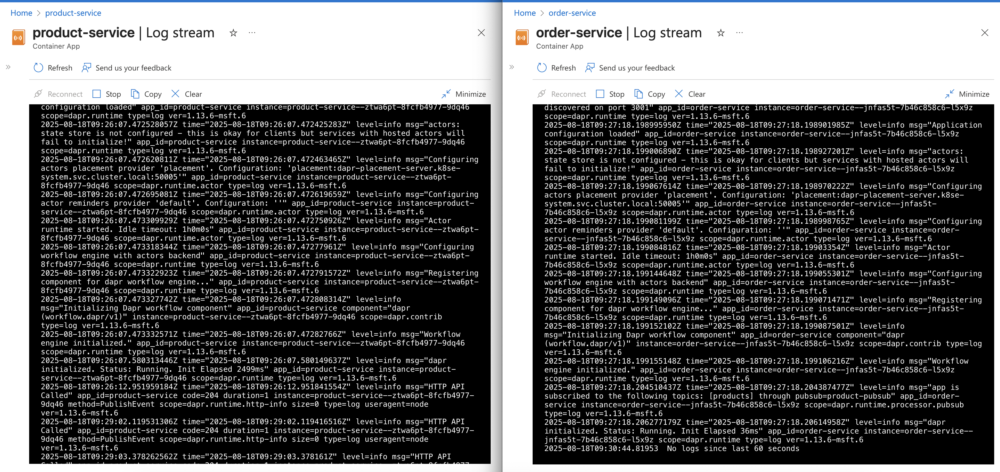

# Containerized Microservice with Azure Container Apps and Dapr

## Source code, screenshots and full documentation
Due to LMS limitations of accepting PDF files only, the ZIP file requested for Introspect 1B is provided as an attachment. 
> [!IMPORTANT]
> [You can download the ZIP file HERE](https://github.com/gratian-dicu-sv/cna2-introspect1b/archive/refs/heads/main.zip)


This project demonstrates a containerized microservice architecture using Azure Container Apps (ACA) with Dapr for pub/sub messaging.

It includes two simple Node.js microservices:
-   **ProductService**: Publishes an event when a new product is created.
-   **OrderService**: Subscribes to the product creation event.

The entire infrastructure is defined using Terraform and can be deployed with a single script.

## Prerequisites

-   [Azure CLI](https://docs.microsoft.com/en-us/cli/azure/install-azure-cli)
-   [Docker](https://docs.docker.com/get-docker/)
-   [Terraform](https://learn.hashicorp.com/tutorials/terraform/install-cli)

## Deployment

The project includes two deployment scripts: one for the main application and an optional one for deploying Azure AI services.

### Main Application (Product & Order Services)

The `deploy.sh` script automates the entire process of deploying the microservices and their required infrastructure, including:
-   Azure Resource Group
-   Azure Container Registry (ACR)
-   Azure Container Apps Environment
-   Redis container for Dapr pub/sub
-   ProductService and OrderService Container Apps

**Usage:**

The script requires a resource group name and optionally accepts a location.

```bash
./deploy.sh <ResourceGroupName> [Location]
```

**Example (deploying to a new resource group in the default "East US" location):**
```bash
./deploy.sh my-dapr-rg
```

**Example (deploying to a specific location):**
```bash
./deploy.sh my-dapr-rg "West Europe"
```

### Azure AI Foundry (Optional)

The `deploy-ai.sh` script deploys an Azure AI Foundry and an associated project. This is an optional deployment and is separate from the main application.

**Usage:**

This script also requires a resource group name and optionally accepts a location.

```bash
./deploy-ai.sh <ResourceGroupName> [Location]
```

**Example (deploying to a new resource group):**
```bash
./deploy-ai.sh my-ai-foundry-rg
```

## Testing the Application

After running `deploy.sh`, the script will output the public URLs for the two services.

1.  **Publish a Product Event:**
    Send a `POST` request to the `ProductService`. Replace `<PRODUCT_SERVICE_URL>` with the actual URL from the script's output.

    ```bash
    curl -X POST <PRODUCT_SERVICE_URL>/products \
    -H "Content-Type: application/json" \
    -d '{ "id": "101", "name": "Laptop", "price": 1299.99 }'
    ```

2.  **Verify the Order Service Received the Event:**
    Send a `GET` request to the `OrderService`. You should see the product you just created in the response.

    ```bash
    curl <ORDER_SERVICE_URL>/orders
    ```

## Deployment logs
~/Projects/CNA-level2/Introspect 1/Introspect1B-GratianDicu λ ./deploy.sh
Logging in to Azure...
A web browser has been opened at https://login.microsoftonline.com/organizations/oauth2/v2.0/authorize. Please continue the login in the web browser. If no web browser is available or if the web browser fails to open, use device code flow with `az login --use-device-code`.

Retrieving tenants and subscriptions for the selection...

[Tenant and subscription selection]

No     Subscription name        Subscription ID                       Tenant
-----  -----------------------  ------------------------------------  ---------------
[1] *  npstackro-1676009353957  0d6ec8c7-b598-4b2e-8607-4aba682dbc1f  VlabsStackroute

The default is marked with an *; the default tenant is 'VlabsStackroute' and subscription is 'npstackro-1676009353957' (0d6ec8c7-b598-4b2e-8607-4aba682dbc1f).

Select a subscription and tenant (Type a number or Enter for no changes): 

Tenant: VlabsStackroute
Subscription: npstackro-1676009353957 (0d6ec8c7-b598-4b2e-8607-4aba682dbc1f)

[Announcements]
With the new Azure CLI login experience, you can select the subscription you want to use more easily. Learn more about it and its configuration at https://go.microsoft.com/fwlink/?linkid=2271236

If you encounter any problem, please open an issue at https://aka.ms/azclibug

[Warning] The login output has been updated. Please be aware that it no longer displays the full list of available subscriptions by default.

Registering required Azure providers...
Initializing Terraform...
Initializing the backend...
Initializing provider plugins...
- Reusing previous version of hashicorp/azurerm from the dependency lock file
- Reusing previous version of hashicorp/random from the dependency lock file
- Using previously-installed hashicorp/azurerm v3.117.1
- Using previously-installed hashicorp/random v3.7.2

Terraform has been successfully initialized!

You may now begin working with Terraform. Try running "terraform plan" to see
any changes that are required for your infrastructure. All Terraform commands
should now work.

If you ever set or change modules or backend configuration for Terraform,
rerun this command to reinitialize your working directory. If you forget, other
commands will detect it and remind you to do so if necessary.
Deploying ACR...
random_string.suffix: Refreshing state... [id=imkye2]
azurerm_resource_group.dapr_rg: Refreshing state... [id=/subscriptions/0d6ec8c7-b598-4b2e-8607-4aba682dbc1f/resourceGroups/dapr-rg]
azurerm_container_registry.dapr_acr: Refreshing state... [id=/subscriptions/0d6ec8c7-b598-4b2e-8607-4aba682dbc1f/resourceGroups/dapr-rg/providers/Microsoft.ContainerRegistry/registries/dapracrimkye2]

No changes. Your infrastructure matches the configuration.

Terraform has compared your real infrastructure against your configuration and found no differences, so no changes are needed.
╷
│ Warning: Resource targeting is in effect
│ 
│ You are creating a plan with the -target option, which means that the result of this plan may not represent all of the changes requested by the current
│ configuration.
│ 
│ The -target option is not for routine use, and is provided only for exceptional situations such as recovering from errors or mistakes, or when Terraform
│ specifically suggests to use it as part of an error message.
╵
╷
│ Warning: Applied changes may be incomplete
│ 
│ The plan was created with the -target option in effect, so some changes requested in the configuration may have been ignored and the output values may not be
│ fully updated. Run the following command to verify that no other changes are pending:
│     terraform plan
│ 
│ Note that the -target option is not suitable for routine use, and is provided only for exceptional situations such as recovering from errors or mistakes, or
│ when Terraform specifically suggests to use it as part of an error message.
╵

Apply complete! Resources: 0 added, 0 changed, 0 destroyed.

Outputs:

acr_name = "dapracrimkye2"
order_service_url = "https://order-service--jnfas5t.redmeadow-e462cb97.eastus.azurecontainerapps.io"
product_service_url = "https://product-service--ztwa6pt.redmeadow-e462cb97.eastus.azurecontainerapps.io"
ACR Name: dapracrimkye2
ACR Login Server: dapracrimkye2.azurecr.io
Logging in to ACR...
Login Succeeded
Building ProductService image for AMD64...
[+] Building 9.2s (12/12) FINISHED                                                                                                          docker:desktop-linux
 => [internal] load build definition from Dockerfile                                                                                                        0.0s
 => => transferring dockerfile: 164B                                                                                                                        0.0s
 => [internal] load .dockerignore                                                                                                                           0.0s
 => => transferring context: 2B                                                                                                                             0.0s
 => [internal] load metadata for docker.io/library/node:20                                                                                                  1.4s
 => [auth] library/node:pull token for registry-1.docker.io                                                                                                 0.0s
 => [1/5] FROM docker.io/library/node:20@sha256:572a90df10a58ebb7d3f223d661d964a6c2383a9c2b5763162b4f631c53dc56a                                            0.0s
 => [internal] load build context                                                                                                                           0.0s
 => => transferring context: 92B                                                                                                                            0.0s
 => CACHED [2/5] WORKDIR /usr/src/app                                                                                                                       0.0s
 => CACHED [3/5] COPY package*.json ./                                                                                                                      0.0s
 => CACHED [4/5] RUN npm install                                                                                                                            0.0s
 => CACHED [5/5] COPY . .                                                                                                                                   0.0s
 => exporting to image                                                                                                                                      0.0s
 => => exporting layers                                                                                                                                     0.0s
 => => writing image sha256:4542495f28643af74259f2b0682235aa6311fa01458bfac18a073a7ab1cb52e0                                                                0.0s
 => => naming to dapracrimkye2.azurecr.io/product-service:latest                                                                                            0.0s
 => pushing dapracrimkye2.azurecr.io/product-service:latest with docker                                                                                     4.1s
 => => pushing layer 7a56ebf99102                                                                                                                           3.2s
 => => pushing layer 368e19bb9beb                                                                                                                           3.2s
 => => pushing layer 8e5ab9c0fbbd                                                                                                                           3.2s
 => => pushing layer e430223cf6b7                                                                                                                           3.2s
 => => pushing layer 63460597559f                                                                                                                           3.2s
 => => pushing layer d04821c9c5d2                                                                                                                           3.2s
 => => pushing layer 8ae1707cad3d                                                                                                                           3.2s
 => => pushing layer f4cae176fb11                                                                                                                           3.2s
 => => pushing layer 56bc20dcf91d                                                                                                                           3.2s
 => => pushing layer 746379c6de53                                                                                                                           3.2s
 => => pushing layer bf4805173473                                                                                                                           3.2s
 => => pushing layer 4668f0f488e5                                                                                                                           3.2s
Building OrderService image for AMD64...
[+] Building 8.3s (11/11) FINISHED                                                                                                          docker:desktop-linux
 => [internal] load .dockerignore                                                                                                                           0.0s
 => => transferring context: 2B                                                                                                                             0.0s
 => [internal] load build definition from Dockerfile                                                                                                        0.0s
 => => transferring dockerfile: 164B                                                                                                                        0.0s
 => [internal] load metadata for docker.io/library/node:20                                                                                                  0.9s
 => [1/5] FROM docker.io/library/node:20@sha256:572a90df10a58ebb7d3f223d661d964a6c2383a9c2b5763162b4f631c53dc56a                                            0.0s
 => [internal] load build context                                                                                                                           0.0s
 => => transferring context: 92B                                                                                                                            0.0s
 => CACHED [2/5] WORKDIR /usr/src/app                                                                                                                       0.0s
 => CACHED [3/5] COPY package*.json ./                                                                                                                      0.0s
 => CACHED [4/5] RUN npm install                                                                                                                            0.0s
 => CACHED [5/5] COPY . .                                                                                                                                   0.0s
 => exporting to image                                                                                                                                      0.0s
 => => exporting layers                                                                                                                                     0.0s
 => => writing image sha256:b2e390706cf7de265f1c9c24ae3614da8b54ad64bd215003a8c4fd1556f9846b                                                                0.0s
 => => naming to dapracrimkye2.azurecr.io/order-service:latest                                                                                              0.0s
 => pushing dapracrimkye2.azurecr.io/order-service:latest with docker                                                                                       3.9s
 => => pushing layer 8d4c1a90cf57                                                                                                                           3.0s
 => => pushing layer b4048722cb10                                                                                                                           3.0s
 => => pushing layer 826bbe7f3a07                                                                                                                           3.0s
 => => pushing layer e430223cf6b7                                                                                                                           3.0s
 => => pushing layer 63460597559f                                                                                                                           3.0s
 => => pushing layer d04821c9c5d2                                                                                                                           3.0s
 => => pushing layer 8ae1707cad3d                                                                                                                           3.0s
 => => pushing layer f4cae176fb11                                                                                                                           3.0s
 => => pushing layer 56bc20dcf91d                                                                                                                           3.0s
 => => pushing layer 746379c6de53                                                                                                                           3.0s
 => => pushing layer bf4805173473                                                                                                                           3.0s
 => => pushing layer 4668f0f488e5                                                                                                                           3.0s
Deploying the rest of the infrastructure...
random_string.suffix: Refreshing state... [id=imkye2]
azurerm_resource_group.dapr_rg: Refreshing state... [id=/subscriptions/0d6ec8c7-b598-4b2e-8607-4aba682dbc1f/resourceGroups/dapr-rg]
azurerm_log_analytics_workspace.dapr_logs: Refreshing state... [id=/subscriptions/0d6ec8c7-b598-4b2e-8607-4aba682dbc1f/resourceGroups/dapr-rg/providers/Microsoft.OperationalInsights/workspaces/dapr-logs]
azurerm_container_registry.dapr_acr: Refreshing state... [id=/subscriptions/0d6ec8c7-b598-4b2e-8607-4aba682dbc1f/resourceGroups/dapr-rg/providers/Microsoft.ContainerRegistry/registries/dapracrimkye2]
azurerm_container_app_environment.dapr_env: Refreshing state... [id=/subscriptions/0d6ec8c7-b598-4b2e-8607-4aba682dbc1f/resourceGroups/dapr-rg/providers/Microsoft.App/managedEnvironments/dapr-env]
azurerm_container_app_environment_dapr_component.pubsub: Refreshing state... [id=/subscriptions/0d6ec8c7-b598-4b2e-8607-4aba682dbc1f/resourceGroups/dapr-rg/providers/Microsoft.App/managedEnvironments/dapr-env/daprComponents/product-pubsub]
azurerm_container_app.redis: Refreshing state... [id=/subscriptions/0d6ec8c7-b598-4b2e-8607-4aba682dbc1f/resourceGroups/dapr-rg/providers/Microsoft.App/containerApps/redis]
azurerm_container_app.product_service: Refreshing state... [id=/subscriptions/0d6ec8c7-b598-4b2e-8607-4aba682dbc1f/resourceGroups/dapr-rg/providers/Microsoft.App/containerApps/product-service]
azurerm_container_app.order_service: Refreshing state... [id=/subscriptions/0d6ec8c7-b598-4b2e-8607-4aba682dbc1f/resourceGroups/dapr-rg/providers/Microsoft.App/containerApps/order-service]

No changes. Your infrastructure matches the configuration.

Terraform has compared your real infrastructure against your configuration and found no differences, so no changes are needed.

Apply complete! Resources: 0 added, 0 changed, 0 destroyed.

Outputs:

acr_name = "dapracrimkye2"
order_service_url = "https://order-service--jnfas5t.redmeadow-e462cb97.eastus.azurecontainerapps.io"
product_service_url = "https://product-service--ztwa6pt.redmeadow-e462cb97.eastus.azurecontainerapps.io"
Deployment complete!
Product Service URL: https://product-service--ztwa6pt.redmeadow-e462cb97.eastus.azurecontainerapps.io
Order Service URL: https://order-service--jnfas5t.redmeadow-e462cb97.eastus.azurecontainerapps.io

## Product and Order service logs


## Other screnshots


